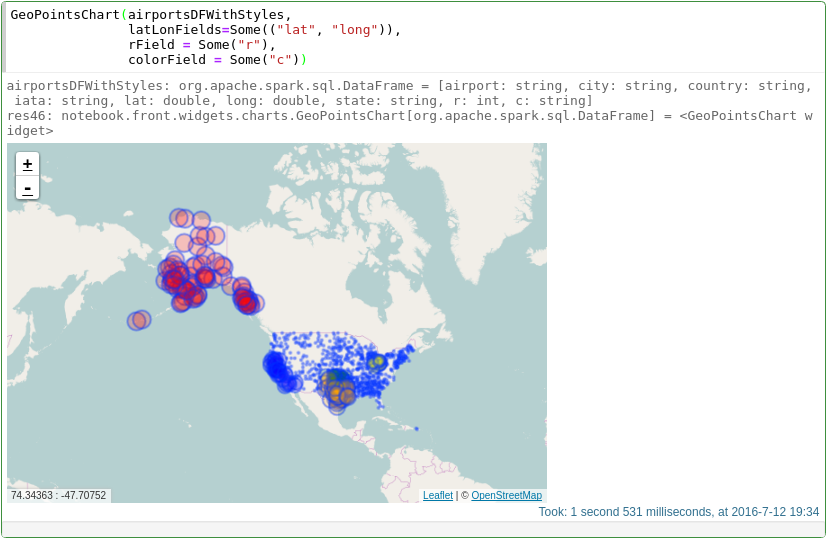

Spark Notebook
==============

The Spark Notebook is the open source notebook aimed at enterprise environments, providing Data Scientists and Data Engineers with  an interactive web-based editor that can combine Scala code, SQL queries, Markup and JavaScript in a collaborative manner to explore, analyse and learn from massive data sets.

The Spark Notebook allows performing [reproducible analysis](http://simplystatistics.org/2014/06/06/the-real-reason-reproducible-research-is-important/) with Scala, Apache Spark and the Big Data ecosystem.

## Features Highlights

### 

Apache Spark is available out of the box, and is simply accessed by the variable `sparkContext` or `sc`.

#### Multiple Spark Context Support

One of the top most useful feature brought by the Spark Notebook is its separation of the running notebooks.
Each started notebook will spawn a new JVM with its own SparkSession instance. This allows a maximal flexibility for:

* dependencies without clashes
* access different clusters
* tune differently each notebook
* external scheduling (on the roadmap)

#### Metadata-driven configuration

We achieve maximum flexibility with the availability of multiple `sparkContext`s by enabling [metadata driven](./docs/metadata.md) configuration.

### Scala

The Spark Notebook supports exclusively the Scala programming language, the [Unpredicted Lingua Franca for Data Science](https://youtu.be/3_oV25nZz8I) and extensibly exploits the JVM ecosystem of libraries to drive an smooth evolution of data-driven software from exploration to production.

The Spark Notebook is available for *NIX and Windows systems in easy to use ZIP/TAR, Docker and DEB packages.

### Reactive

All components in the Spark Notebook are dynamic and reactive.

The Spark Notebook comes with dynamic charts and most (if not all) components can be listened for and can react to events. This is very helpful in many cases, for example:
* data entering the system live at runtime
* visually plots of events
* multiple interconnected visual components
Dynamic and reactive components mean that you don't have write the html, js, server code just for basic use cases.

## Quick Start

Go to [Quick Start](./docs/quick_start.md) for our 5-minutes guide to get up and running with the Spark Notebook.

C'mon on to [Gitter](https://gitter.im/andypetrella/spark-notebook?utm_source=badge&utm_medium=badge&utm_campaign=pr-badge&utm_content=badge)
to discuss things, to get some help, or to start contributing!

## Learn more

* [Explore the Spark Notebook](./docs/exploring_notebook.md)
* [HTML Widgets](./docs/widgets_html.md)
* [Visualization Widgets](./docs/widgets_viz.md)
* [Notebook Browser](./docs/notebook_browser.md)
* Configuration
    * [Notebook Configuration and Metadata](./docs/metadata.md)
    * [Using Cluster Configurations](./docs/using_cluster_tab.md)
    * [Versioned notebook storage with Git(hub)](./modules/git-notebook-provider/README.md)
* [Running on Clusters and Clouds](./docs/clusters_clouds.md)
* [Community](./docs/community.md)
* Advanced Topics
    * [Using Releases](./docs/using_releases.md)
    * [Building from Sources](./docs/build_from_source.md)
    * [Creating Specific Distributions](./docs/build_specific_distros.md)
    * [Creating your own custom visualizations](./docs/custom_charts.md)
    * [User Authentication](./docs/authentication.md)
      - Supports: `Basic, Form & Kerberos` auth, and many more [via `pac4j` (OAuth, OpendID, ...)](https://github.com/pac4j/pac4j)
      - Passing the logged in user to Secure Hadoop+YARN clusters via the [`proxy-user` impersonation](./docs/proxyuser_impersonation.md)
* Advanced: How to Develop/improve `spark-notebook`
    * [Overview of Project structure](./docs/code_structure.md)

## Testimonials
### Skymind - [Deeplearning4j](http://Deeplearning4j.org)

> Spark Notebook gives us a clean, useful way to mix code and prose when we demo and explain our tech to customers. The Spark ecosystem needed this.

### [Vinted.com](http://www.vinted.com)

> It allows our analysts and developers (15+ users) to run ad-hoc queries, to perform complex data analysis and data visualisations, prototype machine learning pipelines. In addition, we use it to power our BI dashboards.

## Adopters

| Name                                   | Logo                                                                                                                           | URL                                                                                              | Description                                                                                                                                                                                                           |
|----------------------------------------|--------------------------------------------------------------------------------------------------------------------------------|--------------------------------------------------------------------------------------------------|-----------------------------------------------------------------------------------------------------------------------------------------------------------------------------------------------------------------------|
| Kensu                            |                                                  | [website](http://www.kensu.io)                                                           | Lifting Data Science to the Enterprise level                                                                                                                                                                                |
| Agile Lab                              |                                                       | [website](http://www.agilelab.it)                                                                | The only Italian Spark Certified systems integrator                                                                                                                                                                   |
| CloudPhysics                           |                                          | [website](http://www.cloudphysics.com)                                                           | Data-Driven Inisghts for Smarter IT                                                                                                                                                                                   |
| Aliyun                                 |                                          | [product](http://market.aliyun.com/products/56014009/jxsc000194.html?spm=5176.900004.4.1.WGc3Ei) | Spark runtime environment on ECS and management tool of Spark Cluster running on Aliyun ECS                                                                                                                             |
| EMBL European Bioinformatics Institute |                                                         | [website](http://www.ebi.ac.uk/)                                                                 | EMBL-EBI provides freely available data from life science experiments, performs basic research in computational biology and offers an extensive user training programme, supporting researchers in academia and industry. |
| Metail                                 |                                               | [website](http://metail.com/)                                                                    | The best body shape and garment fit company in the world. To create and empower everyone’s online body identity.                                                                                                          |
| kt NexR                                |                                                                         | [website](http://ktnexr.com)                                                                     | the kt NexR is one of the leading BigData company in the Korea from 2007.                                                                                                                                             |
| Skymind                                |                                                                   | [website](http://www.skymind.io)                                                                 | At Skymind, we’re tackling some of the most advanced problems in data analysis and machine intelligence. We offer start-of-the-art, flexible, scalable deep learning for industry.                                      |
| Amino                                  |                                                           | [website](http://www.Amino.com)                                                                  | A new way to get the facts about your health care choices.                                                                                                                                                            |
| Vinted                                 |                                                      | [website](http://www.vinted.com/)                                                                | Online marketplace and a social network focused on young women’s lifestyle.                                                                                                                                             |
| Vingle                                 |                                                       | [website](https://www.vingle.net)                                                                | Vingle is the community where you can meet someone like you.                                                                                                                                                          |
| 47 Degrees                             |                                                               | [website](http://www.47deg.com)                                                                  | 47 Degrees is a global consulting firm and certified Typesafe & Databricks Partner specializing in Scala & Spark.                                                                                                       |
| Barclays                               |  | [website](http://www.barclays.com)                                                               | Barclays is a British multinational banking and financial services company headquartered in London.                                                                                                                     |
| Swisscom                               |                                                   | [website](https://www.swisscom.ch)                                                               | Swisscom is the leading mobile service provider in Switzerland.                                                                                                                                                         |
| Knoldus                                |                                                                  | [website](http://www.knoldus.com)                                                                |  Knoldus is a global consulting firm and certified "Select" Lightbend & Databricks Partner specializing in Scala & Spark ecosystem.                                                                                     |                                                             |
