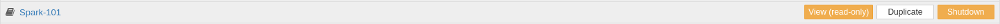
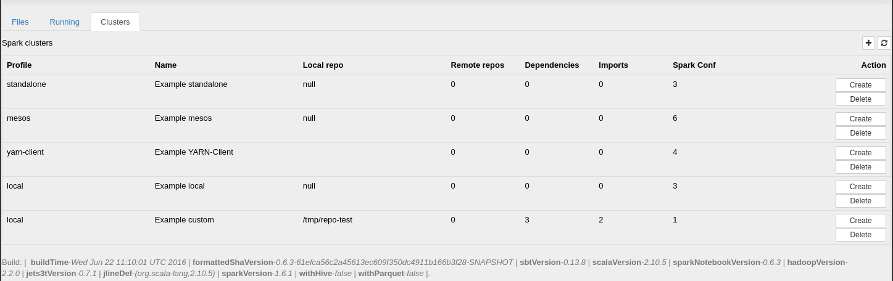

# Documentation

## The Notebook Browser

The Notebook browser consists of three tabs: Files, Running  and Cluster

### Files Tab
This tab shows the file browser and gives quick access to the notebooks hosted in this server. The folder structure allows for a familiar hierarchical organization of the notebooks. 
The Spark Notebook comes loaded with many examples that will show in the file browser. 
These examples are the best way to get familiar with the notebook.  Feel free to explore them after this tutorial.

Each Notebook entry consists of the Notebook name and several function buttons:

* Clicking on the notebook name will open the notebook in the interactive editor.
* View (read-only):  opens the notebook in read-only mode. The notebook contents will be rendered in the same state as they were last saved. This mode also allows for a "follow along" visualization: Other user can open the same notebook in interactive mode, and the _read-only_ visualization will be updated as changes happen in the interactive mode.
* Duplicate:  Creates a new copy the selected notebook. It will pop a dialog asking for confirmation.  
* Delete | Shutdown : This button changes mode with the state of the notebook:
  * Shutdown -   If the notebook is currently running, this button will display "shutdown", allowing us to shutdown the running notebook. (see the #notebook section for more details on the runtime)
  * Delete -  a stopped notebook can be deleted from the filesystem. 

### The Running Tab
 

This tab shows a summary of the notebooks currently running in the system. Learn more about notebook resources. [TODO]
In this view, the notebook listing only show the "View (read only" and "Shutdown" buttons described above.

### The Clusters Tab

This tab lets the user to create pre-defined configurations corresponding to the environment(s) that the notebook can connect to. In particular, this permits the specification of one or more Spark/Hadoop ecosystems for the Notebook to run against.

