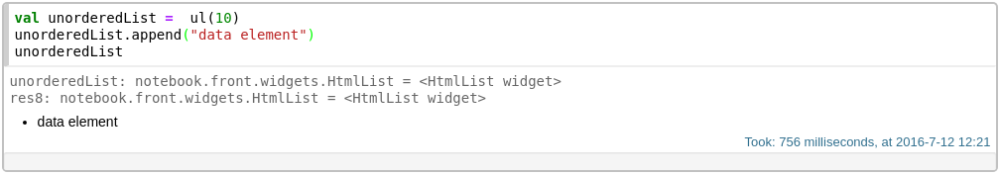

# Documentation

## Widgets

There're many widgets avaiable in the Spark Notebook that can be used to enrich the interaction with the data.  Text-based widgets can help to sample or select data while graphical widgets will provide us data visualizations to help us build our intuition and understanding of the data. 

See also: [Graphical Widgets](./widgets_viz.md)

### HTML Widgets

These are widgets dedicated to display and interact with data elements. They can be useful to show samples of large datasets, to choose specific data points or to show continuous updates of streaming data.
Widgets are represented by Scala classes and therefore can be created and manipulated as objects.
It's important that the widget object is returned  as the resulting value of the cell so that the Spark Notebook can "pick it up" and display it.

This is an example on how to define an `UnorderedList` that can hold up to 10 items. Note how the value of the variable is returned as the final result of the cell.



#### Unordered List
Creates an unordered list of the given number of elements

##### API
```scala
// Creates an unordered list of the given capacity, initialData and prefill
def ul(capacity:Int=10, initData:Seq[String]=Nil, prefill:Option[String]=None)

// adds the sequence of Strings to the list, replacing any existing elements
def apply(d:Seq[String])

// adds a single String element to the list 
def append(s:String)

// appends a sequence of Strings to this list
def appendAll(s:Seq[String]) 


##### Example

```scala
val unorderedList = ul(11)
unorderedList.append("one")
```

#### Ordered List
Creates an ordered list of the given number of elements

##### API
```scala
def ol(capacity:Int=10, initData:Seq[String]=Nil, prefill:Option[String]=None)

// adds the sequence of Strings to the list, replacing any existing elements
def apply(d:Seq[String])

// adds a single String element to the list 
def append(s:String)

// appends a sequence of Strings to this list
def appendAll(s:Seq[String]) 


##### Example
```scala
val orderedList = ol(num-elements)
```

#### Image
Displays an image from a file or URL

##### API

```scala
def img(tpe:String="png", width:String="150px", height:String="150px")

// displays an image from an URL
def url(u:java.net.URL)

// displays an image from a file
def file(f:java.io.File)
```

##### Example

```scala
val diagram = img() // default type and size
diagram.url(new URL("http://ser.ver.add.ress/images/notebook.png)
```
_note that the type of the image must correspond to the 


#### Text output
Shows a paragraph of text

##### API

```scala
// programmatically creates a paragraph
def text(value: String)

```

##### Example

```scala
val students:Seq[String] = Seq("Alice","John", "Britt")

val studentsInReport = text(students.mkString(", "))

```

#### thing
--description--

##### API

```scala
```

##### Example

```scala
```


------

#### thing
--description--

##### API

```scala
```

##### Example

```scala
```


```scala
val text = out("")
```


#### 


### Graphical Widgets  