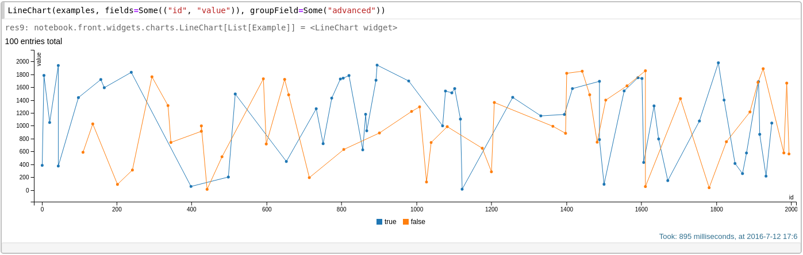
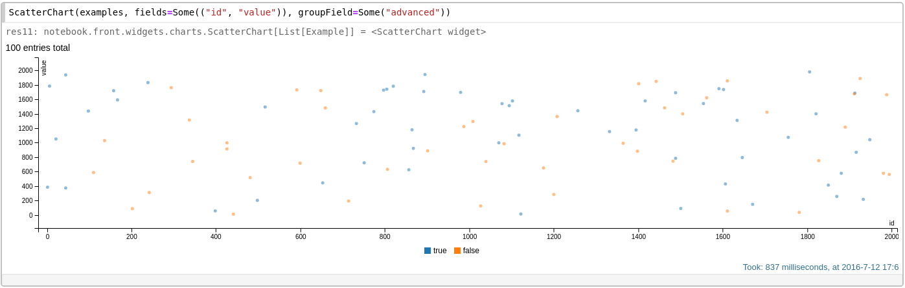
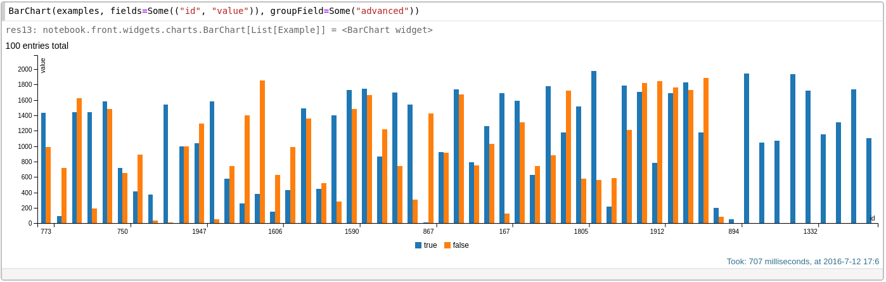
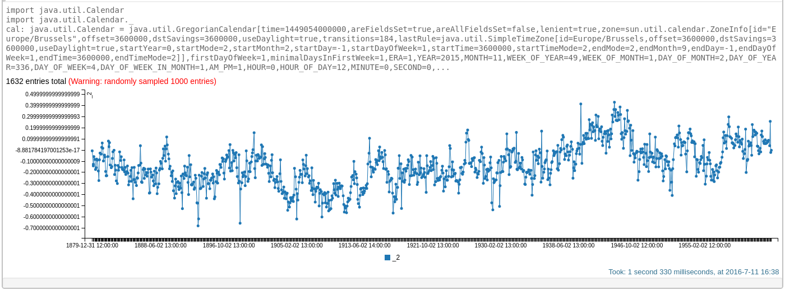
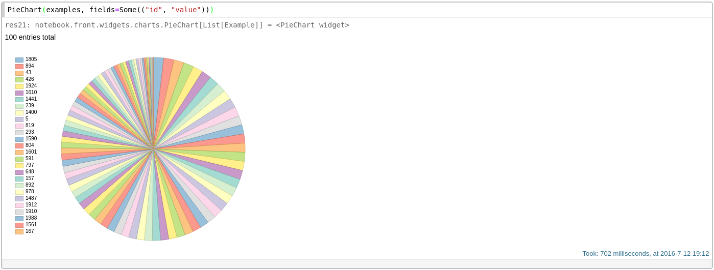
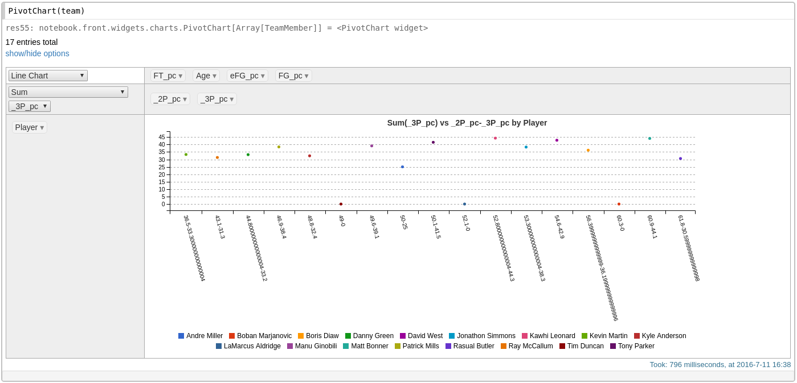
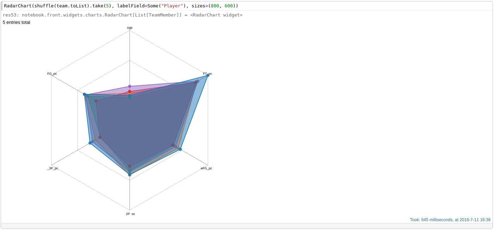

# Documentation

## Widgets

There're many widgets avaiable in the Spark Notebook that can be used to enrich the interaction with the data.  Text-based widgets can help to sample or select data while graphical widgets will provide us data visualizations to help us build our intuition and understanding of the data. 

### Graphical Widgets

The easiest and fastest way to visualize data in the Spark Notebook is to return collections of data from the a cell and use the built-in visualization.

The built-in visualizations will be automatically attempted on data collections of `Tuple`s and `case class`es. In particular, `case class`es definitions may be used to populate names of axes and other values (like colors, line styles, ...).

For more advanced visualizations, the Spark Notebook comes packed with customizable charts ranging from simple line and bar charts to advanced pivot tables and geo-charts.

#### Common Chart API

Charts can be reactively updated with new data through these methods:

```scala
// updates the chart with the data provided, replacing existing data, if any.
def applyOn(newData:C)

// adds new data points to the chart. 
// Using resetInit=true will result in the data being replaced, like applyOn(...)
def addAndApply(otherData:C, resetInit:Boolean=false)

// changes the maximum number of data points displayed by the chart
def newMax(max:Int)


#### Table Chart

A tabular visualization of the data. 

```scala
case class TableChart[C:ToPoints:Sampler](
	originalData:C,
	filterCol:Option[Seq[String]]=None,
	override val sizes:(Int, Int)=(600, 400),
	maxPoints:Int = Utils.Defaults.DEFAULT_MAX_POINTS
)
```


#### Line Chart

```scala
case class LineChart[C:ToPoints:Sampler](
    originalData:C,
    fields:Option[(String, String)]=None,
    override val sizes:(Int, Int)=(600, 400),
    maxPoints:Int = DEFAULT_MAX_POINTS,
    groupField: Option[String]=None
  )
```


#### Scatter Chart

```scala
case class ScatterChart[C:ToPoints:Sampler](
    originalData:C,
    fields:Option[(String, String)]=None,
    override val sizes:(Int, Int)=(600, 400),
    maxPoints:Int = DEFAULT_MAX_POINTS,
    groupField: Option[String]=None
  )
```



#### Bar Chart

```scala
case class BarChart[C:ToPoints:Sampler](
    originalData:C,
    fields:Option[(String, String)]=None,
    override val sizes:(Int, Int)=(600, 400),
    maxPoints:Int = DEFAULT_MAX_POINTS,
    groupField: Option[String]=None
  )

```



#### Time Series Chart

```scala
case class TimeseriesChart[C:ToPoints:Sampler](
    originalData:C,
    fields:Option[(String, String)]=None,
    override val sizes:(Int, Int)=(600, 400),
    maxPoints:Int = DEFAULT_MAX_POINTS,
    groupField: Option[String]=None,
    tickFormat:String = "%Y-%m-%d %H:%M:%S"
  )
```

  

#### Pie Chart

```scala
case class PieChart[C:ToPoints:Sampler](
	originalData:C, 
	fields:Option[(String, String)]=None, 
	override val sizes:(Int, Int)=(600, 400),
	 maxPoints:Int = DEFAULT_MAX_POINTS
)
```




#### Pivot Chart
The Pivot chart allows to 'pivot' over a selectable data column using a number of built-in aggregations.
The "show/hide" options toggles the aggregation menu. When 'off', only the resulting chart will be displayed.

```scala
case class PivotChart[C:ToPoints:Sampler](
  originalData:C,
  override val sizes:(Int, Int)=(600, 400),
  maxPoints:Int = DEFAULT_MAX_POINTS,
  derivedAttributes:JsObject=play.api.libs.json.Json.obj(),
  options: Map[String, String] = Map.empty
)

```


#### Graphs
A graph is a common way to represent data where connections between elements is important.

* `Graph[T]`: abstract class defining a graph component with an id of type T, a value of type Any and a color
* `Node[T]`: defines a node as a circle which can be specified a radius and its position ( xx ,  yy ) (initial or static if it's fixed)
* `Edge[T]`: defines an edge using the ids of both ends

```scala
case class GraphChart[C:ToPoints:Sampler](
	originalData:C, 
	override val sizes:(Int, Int)=(600, 400), 
	maxPoints:Int = DEFAULT_MAX_POINTS,
	charge:Int= -30, 
	linkDistance:Int=20, 
	linkStrength:Double=1.0
)
```


#### Geo Charts

There are two types of geo charts:
* `GeoPointsChart` for simple points lat long points
* `GeoChart` for GeoJSON or opengis data

##### GeoPointsChart

```scala
case class GeoPointsChart[C:ToPoints:Sampler](
  originalData:C,
  override val sizes:(Int, Int)=(600, 400),
  maxPoints:Int = DEFAULT_MAX_POINTS,
  latLonFields:Option[(String, String)]=None,
  rField:Option[String]=None,
  colorField:Option[String]=None
)
```


##### GeoChart

```scala
case class GeoChart[C:ToPoints:Sampler](
  originalData:C,
  override val sizes:(Int, Int)=(600, 400),
  maxPoints:Int = DEFAULT_MAX_POINTS,
  geometryField:Option[String]=None,
  rField:Option[String]=None,
  colorField:Option[String]=None,
  fillColorField:Option[String]=None)
 ```

_note how the Museum Gardens highlighted by a polygon_

#### Radar Chart

Displays values across several axes. It provides a visual comparison of data points over several features at once.

```scala
case class RadarChart[C:ToPoints:Sampler](
    originalData:C,
    labelField:Option[String]=None,
    override val sizes:(Int, Int)=(600, 400),
    maxPoints:Int = DEFAULT_MAX_POINTS
  )
```




#### Parallel Coordinates

Displays flows/connections among several steps

```scala
case class ParallelCoordChart[C:ToPoints:Sampler](
    originalData:C,
    override val sizes:(Int, Int)=(600, 400),
    maxPoints:Int = DEFAULT_MAX_POINTS
  )
```


